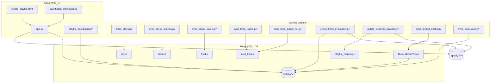

# Spotify Smart Playlist Generator & Library Tracker

## 1. Project Summary

This project is a single-user Spotify library and play history tracker with a focus on **smart playlist generation**. It is built with Python, PostgreSQL, and Flask, and supports dynamic playlist rules, robust onboarding, and full/incremental sync logic. The user authenticates with Spotify via a secure web UI (using OAuth), and all tokens are managed automatically. The backend sync jobs run via **GitHub Actions** for automation and scheduling, while the Flask frontend provides a dashboard for onboarding, playlist management, and sync logs. The architecture is optimized for **Render.com** deployment, with CI/CD integration via GitHub Actions.

---

## 2. Features

- **Smart Playlists**: Dynamically generated based on user-defined rules (never played, most played, recently added, etc.)
- **Single User Support**: Designed for a single Spotify user account with personalized playlists and library tracking
- **Web UI Onboarding**: Full onboarding flow (admin/user creation, Spotify OAuth, token storage) handled in the browser
- **Dynamic Playlist Rules**: Playlists are defined with flexible, JSON-based rules stored in the database
- **Full vs. Incremental Sync**: Initial sync uses a full pipeline; subsequent syncs are incremental for efficiency
- **Sync Logging**: All sync operations are logged with timestamps and job names for easy diagnostics
- **Materialized Views**: Efficient reporting and querying via unified track data
- **Track Availability Checks**: Ensures playlists only include playable Spotify tracks
- **GitHub Actions Automation**: All sync and playlist jobs are scheduled and managed via reusable workflows
- **Render.com Deployment**: One-click deploy with environment variable configuration and GitHub integration
- **Artist Metadata Tracking**: Tracks artist information such as genres and images in a dedicated table
- **Metrics Dashboard**: Visualizes listening trends, top artists, popularity distribution, and library growth over time
- **Diagnostics Page**: Detects anomalies like duplicate tracks in albums (e.g., caused by reissued album versions)

---

## 3. Folder Structure

```
.
├── .DS_Store
├── .flaskenv
├── .gitignore
├── README.md
├── render.yaml
├── requirements.txt
├── structure.txt
├── .github/
│   ├── .DS_Store
│   ├── .gitignore
│   └── workflows/
│       ├── .DS_Store
│       ├── 00_master_sync.yml
│       ├── 01_sync_albums.yml
│       ├── 02_sync_album_tracks.yml
│       ├── 03a_sync_liked_tracks.yml
│       ├── 03b_sync_liked_tracks_full.yml
│       ├── 03c_sync_artists.yml
│       ├── 04_check_track_availability.yml
│       ├── 05_sync_exclusions.yml
│       ├── 06_build_unified_tracks.yml
│       ├── 07_build_metrics.yml
│       ├── track_plays.yml
│       └── update_dynamic_playlists.yml
├── api_syncs/
│   ├── __init__.py
│   ├── check_track_availability.py
│   ├── materialized_metrics.py
│   ├── materialized_views.py
│   ├── sync_album_tracks.py
│   ├── sync_artists.py
│   ├── sync_exclusions.py
│   ├── sync_liked_tracks.py
│   ├── sync_liked_tracks_full.py
│   ├── sync_saved_albums.py
│   └── track_plays.py
├── app/
│   ├── app.py
│   ├── startup.py
│   ├── users.py
│   ├── db/
│   │   ├── __init__.py
│   │   └── init_db.py
│   ├── static/
│   │   ├── css/
│   │   │   └── styles.css
│   │   └── img/
│   │       └── smartPlaylist_banner.jpg
│   └── templates/
│       ├── base.html
│       ├── create_admin.html
│       ├── create_playlist.html
│       ├── dashboard_playlists.html
│       ├── diagnostics.html
│       ├── footer.html
│       ├── home.html
│       ├── login.html
│       ├── logs.html
│       ├── metrics.html
│       └── show_refresh_token.html
├── playlists/
│   ├── __init__.py
│   ├── generate_playlist.py
│   ├── playlist_sync.py
│   └── update_dynamic_playlists.py
├── routes/
│   ├── __init__.py
│   ├── create_admin.py
│   ├── metrics.py
│   ├── playlist_dashboard.py
│   ├── diagnostics.py
│   └── rule_parser.py
└── utils/
    ├── __init__.py
    ├── create_exclusions_playlist.py
    ├── db_utils.py
    ├── diagnostics.py
    ├── logger.py
    ├── playlist_builder.py
    └── spotify_auth.py
```

---

## 4. Database Schema

| Table                     | Purpose                                                                 |
|---------------------------|-------------------------------------------------------------------------|
| `albums`                 | Stores saved albums                                                      |
| `excluded_tracks`        | Tracks manually excluded from playlist generation                        |
| `liked_tracks`           | All liked tracks with metadata                                           |
| `logs`                   | Logs output from all sync scripts                                        |
| `playlist_mappings`      | Maps playlist slugs/rules to Spotify playlist IDs                        |
| `plays`                  | Complete history of played tracks                                        |
| `track_availability`     | Stores track availability status and last checked timestamp              |
| `tracks`                 | Tracks from albums, includes metadata                                    |
| `artists`                | Stores metadata like genre and image for each artist                     |
| `unified_tracks`         | Materialized view consolidating tracks, plays, and likes                 |
| `users`                  | Stores user accounts, Spotify OAuth tokens, and onboarding status        |

**Relationships:**
- Orphaned tracks (not liked or in albums) are cleaned automatically

---

## 5. Smart Playlist Descriptions

| Script                      | Playlist Logic                                                                 |
|-----------------------------|---------------------------------------------------------------------------------|
| `generate_playlist.py`     | Creates a new playlist in Spotify and stores it in the database with rules     |
| `playlist_sync.py`         | Syncs all playlists in the DB, removes deleted ones, and updates track lists   |
| `update_dynamic_playlst.py`| Refreshes playlists based on current rules stored in the DB                    |

---

## 6. GitHub Actions Workflows and Triggers

All sync and playlist jobs are orchestrated via **GitHub Actions** workflows, located in `.github/workflows/`:

| Workflow File                     | Trigger / Schedule            | Purpose                                                      |
|-----------------------------------|------------------------------|--------------------------------------------------------------|
| `00_master_sync.yml`              | Daily at 07:07 UTC            | Runs the full sync pipeline for all users                    |
| `01_sync_albums.yml`              | Reusable workflow             | Syncs saved albums                                           |
| `02_sync_album_tracks.yml`        | Reusable workflow             | Syncs album track details                                    |
| `03a_sync_liked_tracks.yml`       | Reusable workflow             | Incremental sync of liked tracks                             |
| `03b_sync_liked_tracks_full.yml`  | Reusable workflow             | **Full** liked tracks sync (used for initial onboarding)     |
| `04_check_track_availability.yml` | Manual / Reusable workflow    | Checks if tracks are still available on Spotify              |
| `05_sync_exclusions.yml`          | Reusable workflow             | Syncs tracks added to the manual exclusions playlist         |
| `06_build_unified_tracks.yml`     | Manual / Scheduled            | Builds and refreshes materialized views (`unified_tracks`)   |
| `08_match_canonical_albums.yml`   | Reusable workflow             | Matches albums to canonical versions for deduplication       |
| `track_plays.yml`                 | Every 10 minutes              | Syncs recent play history                                    |
| `update_dynamic_playlists.yml`    | Daily at 10:00 UTC            | Regenerates all smart playlists for all users                |

---

## 7. Environment Variables

| Variable Name           | Description                          |
|------------------------|------------------------------------|
| `SPOTIFY_CLIENT_ID`     | Spotify Developer App Client ID     |
| `SPOTIFY_CLIENT_SECRET` | Spotify Developer App Client Secret |
| `SPOTIFY_REFRESH_TOKEN` | Refresh token for Spotify OAuth     |
| `SPOTIFY_REDIRECT_URI`  | OAuth Redirect URI                  |
| `DB_HOST`               | PostgreSQL database host            |
| `DB_PORT`               | PostgreSQL database port            |
| `DB_NAME`               | PostgreSQL database name            |
| `DB_USER`               | PostgreSQL username                 |
| `DB_PASSWORD`           | PostgreSQL password                 |
| `FLASK_SECRET`          | Flask app secret key for sessions   |

---

## 8. Setup Instructions

### 1. Clone the Repository

```bash
git clone https://github.com/confidentjohn/spotify-oauth-tracker.git
cd spotify-oauth-tracker
```

### 2. Register a Spotify Developer App

- Create an app at the [Spotify Developer Dashboard](https://developer.spotify.com/dashboard/applications)
- Set the Redirect URI to:  
  ```
  https://<your-app>.onrender.com/callback
  ```

### 3. Deploy to Render.com

- Create a new Web Service and point it to `app/app.py`
- Set all required environment variables (see above)
- Enable auto-deploy from GitHub

### 4. Complete Onboarding via Web UI

- **All onboarding is handled in the browser**:
  - Admin/user creation
  - Spotify OAuth and refresh token storage
  - Initial sync detection and launch
- **No need to manually call `/init-db` or hit `/callback`**; the UI guides you through every step.

### 5. Create Smart Playlists

- Use the web UI (`/dashboard/playlists`):
  - Define playlist rules (JSON editor)
  - Auto-generate the playlist in Spotify
  - All playlist mappings and rules are stored automatically

---

## 9. Onboarding Flow

The onboarding flow for a new user is **fully automated via the web UI**:

1. **Visit `/create-admin`**  
   - Creates the first admin account and allows login.

2. **Authenticate with Spotify**  
   - The UI triggers the Spotify OAuth flow; tokens are stored securely in the `users` table.

3. **Exclusions Playlist Creation**  
   - After auth, the system checks for an `exclusions` playlist and creates it if missing.

4. **Initial Sync Detection**  
   - On first login, the homepage (`/`) shows a **"Run Initial Sync"** button if the `unified_tracks` materialized view is missing or empty for the user.
   - On subsequent visits (after sync), the button changes to **"Sync Now"** (incremental update).
   - Detection is based on presence/absence of user data in `unified_tracks`.

5. **Initial Sync Pipeline**  
   - Clicking "Run Initial Sync" launches:
     - `sync_saved_albums.py`
     - `sync_album_tracks.py`
     - `sync_liked_tracks_full.py`
     - `check_track_availability.py`
     - `sync_exclusions.py`
     - `materialized_views.py`

6. **After Sync Completion**  
   - Data and playlists are available via:
     - `/dashboard/playlists`
     - `/logs`

---

## 10. Sync Triggers via Flask UI

The **homepage** displays a sync button based on onboarding state:
- **"Run Initial Sync"**: Appears if the user's `unified_tracks` view is missing or empty (first-time setup)
- **"Sync Now"**: Appears after initial sync, for manual incremental syncs

Clicking these buttons triggers the appropriate backend Python scripts:
- First run: full pipeline (as above)
- Subsequent runs: incremental sync scripts only

All regular syncs and playlist updates are handled by **scheduled GitHub Actions** workflows for security and reliability.

Manual sync routes such as `/sync-saved-albums`, `/sync-liked-tracks`, `/run-tracker`, and `/init-db` **no longer exist** on the web UI.

---

## 11. Architecture Diagram



---

## 12. Rate Limit Handling

All Spotify API requests are wrapped with logic to:

- Detect `429 Too Many Requests` responses  
- Wait for the specified `Retry-After` duration  
- Retry with exponential backoff if needed  

This ensures smooth syncing without manual intervention despite Spotify rate limits.

---

## 13. Testing Instructions

- To test backend sync logic, run scripts from the `api_syncs/` folder, e.g.:
  ```bash
  python api_syncs/sync_liked_tracks.py
  python api_syncs/sync_liked_tracks_full.py
  python api_syncs/check_track_availability.py
  ```
- For manual testing of onboarding and playlist creation:
  - Use the web UI (`/create-admin`, `/dashboard/playlists`, etc.)
  - Observe logs and sync status in `/logs`
- Inspect the `logs` table for sync output and errors
- Verify `unified_tracks` and materialized views for data correctness
- To simulate rate limiting, mock `429` responses in the API layer and observe retry logic

---

## 14. Maintenance Notes

- `init_db.py` sets up all tables, constraints, and user relationships
- `sync_album_tracks.py` only processes albums missing track details
- `sync_liked_tracks_full.py` is used for initial onboarding; `sync_liked_tracks.py` is for incremental updates
- `track_plays.py` runs every 10 minutes and logs play history
- Orphan tracks (not liked and not in albums) are cleaned automatically
- Play history (`plays` table) is never deleted, even if tracks are removed from library
- Materialized views are refreshed regularly for query performance
- Playlist update scripts (`playlist_sync.py`, `update_dynamic_playlists.py`) use `playlist_mappings` for Spotify playlist IDs and ownership
- Playlists are only removed from the DB if deleted directly in Spotify (detected during sync); **no playlist deletions occur via the web UI**
- The web UI manages playlist creation, rule editing, and stores all metadata in `playlist_mappings`
- Playlist `rules` are stored as a `jsonb` field and parsed for dynamic sync logic

---


---

## 15. Playlist Rules Format

Rules are stored in the database as `jsonb` and are used to dynamically select tracks for each playlist. These rules are editable and parsed during playlist generation.

Example rule:

```json
{
  "sort": [{ "by": "album_id", "direction": "asc" }],
  "limit": 50,
  "match": "all",
  "conditions": [
    { "field": "is_liked", "value": "true", "operator": "eq" },
    {
      "match": "any",
      "conditions": [
        { "field": "artist", "value": "pulp", "operator": "eq" },
        { "field": "artist", "value": "oasis", "operator": "eq" }
      ]
    }
  ]
}
```

Supported fields include:
- `field`: e.g., `artist`, `album_id`, `is_liked`, `play_count`, etc.
- `operator`: supports `eq`, `neq`, `lt`, `lte`, `gt`, `gte`, `in`, `not_in`
- `match`: determines logical nesting (`any` for OR, `all` for AND)

---

## 16. Playlist Sync Logic

Smart playlists in this system follow the logic:

- 🎯 All playlists are generated using stored **rules**
- 📅 The `playlist_sync.py` script runs daily to:
  - Sync the playlist using its latest rule set
  - Remove from the DB if the playlist has been deleted on Spotify
- ❌ **Playlists are not deleted** via the web UI; deletion must happen in Spotify
- ✅ Web UI is used for:
  - Creating new playlists
  - Viewing sync history
  - Browsing and editing rules

---

## 17. Example Log Entry

Logs are stored in the `logs` table to help with debugging and automation tracking.

| timestamp           | job                  | message                                      |
|---------------------|----------------------|----------------------------------------------|
| 2025-06-21 10:05:23 | sync_liked_tracks    | ✅ Synced 42 liked tracks (skipped 5 cached) |
| 2025-06-21 10:06:02 | playlist_sync        | ⚠️ Playlist 'test_delete_3' no longer exists on Spotify; removing from DB |
| 2025-06-21 10:10:15 | track_plays          | ✅ Synced 12 new plays from last 10 minutes  |

---


## 18. Known Limitations

- ⚠️ **Rate-limited API**: While handled via retries, high-frequency jobs may still delay
- 🔍 **Missing metadata**: Tracks with no `album_id` or orphaned metadata may be skipped
- 🧑‍🤝‍🧑 **Personal use only**: Built for personal Spotify accounts; not tested for team or shared environments
- 🗑️ **No web UI deletion**: Playlists must be deleted directly in Spotify

---

## 19. Web UI Overview

The Flask-based Web UI is the central hub for onboarding, playlist management, and diagnostics. It supports secure Spotify OAuth and dynamic playlist rule editing.

### Key Features

- 🎛️ **Playlist Dashboard** (`/dashboard/playlists`)
  - View all playlists for the current user
  - Create new playlists with custom rules (JSON editor)
  - View playlist metadata, last synced status, and sync history
  - Launch manual syncs (if enabled)

- 🧩 **Rule-Based Playlist Builder**
  - Enter and edit JSON-formatted rules directly in the UI
  - Rules are stored as `jsonb` and parsed for dynamic playlist generation

- 🔐 **OAuth and User Management**
  - **Single-user admin onboarding and Spotify OAuth via `/create-admin`**
  - Refresh tokens are securely stored and used for all backend syncs

- 📊 **Metrics Dashboard**: Rich visualizations of listening behavior, track popularity, and genre trends
- 🧪 **Diagnostics Page**: View auto-detected data issues like duplicated album entries or missing metadata

### Web UI Pages

| URL Path                     | Purpose                                                               |
|------------------------------|-----------------------------------------------------------------------|
| `/logs`                      | 📜 View recent sync logs and errors for debugging                     |
| `/dashboard/playlists`       | 🎛️ View/manage all smart playlists, their sync status, and rules      |
| `/dashboard/create-playlist` | ➕ Create a new smart playlist and define its rule set                 |
| `/create-admin`              | 👤 Onboard new admin                                                  |
| `/` (home)                   | 🏠 See onboarding state and trigger syncs (Run Initial Sync / Sync Now)|
| `/diagnostics`               | 🧪 Detects potential issues like duplicate album track entries         |

---

## 20. Built By

Created with ❤️ by [John Mitchell](https://jmitchell.app) and ChatGPT  
If you find it useful, consider [buying me a coffee](https://coff.ee/confidentjohn).
