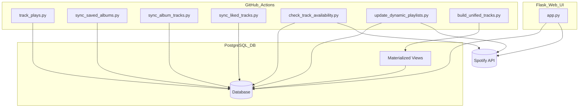

# Spotify Library & Play History Tracker

## 1. Project Summary

This project is a comprehensive Spotify library and play history tracker built with Python, PostgreSQL, and Flask. It automatically syncs your Spotify saved albums, liked tracks, and play history, and generates smart playlists based on various listening patterns. The backend sync jobs run via GitHub Actions and the Flask frontend provides a UI for manual sync triggers, logs, and token management. The project is designed to be deployed easily on Render.com.

---

## 2. Features

- **Daily Sync** of saved albums and liked tracks  
- **Frequent Sync** (every 10 minutes) of recently played tracks  
- **Smart Playlists** generated automatically (never played, most played, recently added, etc.)  
- **Track Availability Checks** to ensure songs are still available on Spotify  
- **Rate Limit Handling** with automatic retries and exponential backoff  
- **Flask Web UI** to trigger syncs, view logs, and manage OAuth tokens  
- **GitHub Actions** workflows for automation and scheduling  
- **Materialized Views** and unified track data for efficient querying and reporting  

---

## 3. Folder Structure

```
spotify-oauth-tracker/
├── api_syncs/                # Spotify sync jobs and track availability checks
│   ├── __init__.py
│   ├── check_track_availability.py  # Checks if tracks are still available on Spotify
│   ├── materialized_views.py         # Creates and refreshes materialized views in DB
│   ├── sync_album_tracks.py          # Syncs tracks for saved albums missing track data
│   ├── sync_exclusions.py            # Syncs tracks added to the manual exclusions playlist
│   ├── sync_liked_tracks_full.py     # Full sync of liked tracks (historical)
│   ├── sync_liked_tracks.py          # Incremental sync of liked tracks
│   ├── sync_saved_albums.py          # Syncs user's saved albums
│   └── track_plays.py                # Syncs recently played tracks every 10 minutes
├── app/                      # Flask frontend (OAuth, UI, sync triggers)
│   ├── app.py
│   └── templates/
│         └── create_playlist.html
│         └── dashboard_playlists.html
├── db/                       # Database initialization script
│   └── init_db.py
├── playlists/                # Smart playlist update scripts
│   ├── generate_playlist.py
│   ├── playlist_sync.py
│   └── update_dynamic_playlst.py
├── reports/                  # Usage reports and analytics (not detailed here)
├── routes/                   # Usage reports and analytics (not detailed here)
│   ├── playlist_dashboard.py
│   └── rule_parser.py
├── utils/                    # Shared utilities for logging and DB access
│   ├── auth.py
│   ├── create_exclusions_playlist.py
│   ├── logger.py
│   ├── playlist_builder.py
│   └── spotify_auth.py
├── .github/workflows/        # GitHub Actions workflows for automation
│   ├── 00_master_sync.yml
│   ├── 01_sync_albums.yml
│   ├── 02_sync_album_tracks.yml
│   ├── 03a_sync_liked_tracks.yml
│   ├── 03b_sync_liked_tracks_full.yml
│   ├── 04_check_track_availability.yml
│   ├── 05_sync_exclusions.yml
│   ├── 06_build_unified_tracks.yml
│   ├── track_plays.yml
│   └── update_dynamic_playlists.yml
├── render.yaml               # Render deployment configuration
├── requirements.txt          # Python dependencies
└── README.md                 # This file
```

---

## 4. Database Schema

| Table                | Purpose                                                  |
|----------------------|----------------------------------------------------------|
| `albums`             | Stores user's saved albums                                |
| `liked_tracks`       | All liked tracks with metadata                            |
| `tracks`             | Tracks from albums, includes metadata                     |
| `plays`              | Complete history of played tracks                         |
| `playlist_mappings`  | Maps playlist slugs to Spotify playlist IDs              |
| `track_availability` | Stores availability status and last checked timestamp    |
| `logs`               | Logs output from sync scripts for debugging              |
| `unified_tracks`     | Materialized view consolidating tracks, plays, and likes |
| `materialized_views` | Managed via script for optimized querying                 |

Tracks may be orphaned (not liked or in albums) and are cleaned automatically.

---

## 5. Smart Playlist Descriptions

| Script                                    | Playlist Logic                                         |
|-------------------------------------------|-------------------------------------------------------|
| `update_dynamic_playlst.py`                | Updates dynamic playlists based on defined rules      |
| `generate_playlist.py`                     | Generates playlists according to specified criteria   |
| `playlist_sync.py`                         | Synchronizes playlists with Spotify                    |

---

## 6. GitHub Actions Workflows and Triggers

| Workflow File                  | Trigger / Schedule           | Purpose                                  |
|-------------------------------|-----------------------------|------------------------------------------|
| `00_master_sync.yml`           | Daily at 07:07 UTC           | Runs full sync of albums, tracks, likes  |
| `01_sync_albums.yml`           | Reusable                    | Syncs saved albums                         |
| `02_sync_album_tracks.yml`     | Reusable                    | Syncs album track details                  |
| `03a_sync_liked_tracks.yml`    | Reusable                    | Syncs liked tracks incrementally           |
| `03b_sync_liked_tracks_full.yml` | Reusable                  | Full liked tracks sync                      |
| `04_check_track_availability.yml` | Manual / Reusable        | Checks if tracks are still available     |
| `05_sync_exclusions.yml`       | Reusable                    | Syncs tracks added to manual exclusions playlist |
| `06_build_unified_tracks.yml`  | Manual / Scheduled           | Builds and refreshes materialized views    |
| `track_plays.yml`              | Every 10 minutes             | Syncs recent play history                   |
| `update_dynamic_playlists.yml` | Daily at 10:00 UTC          | Regenerates all smart playlists             |

---

## 7. Environment Variables

| Variable Name           | Description                          |
|------------------------|------------------------------------|
| `SPOTIFY_CLIENT_ID`     | Spotify Developer App Client ID     |
| `SPOTIFY_CLIENT_SECRET` | Spotify Developer App Client Secret |
| `SPOTIFY_REFRESH_TOKEN` | Refresh token for Spotify OAuth     |
| `SPOTIFY_REDIRECT_URI`  | OAuth Redirect URI                  |
| `DB_HOST`               | PostgreSQL database host            |
| `DB_PORT`               | PostgreSQL database port            |
| `DB_NAME`               | PostgreSQL database name            |
| `DB_USER`               | PostgreSQL username                 |
| `DB_PASSWORD`           | PostgreSQL password                 |
| `FLASK_SECRET`          | Flask app secret key for sessions   |

---

## 8. Setup Instructions

### Clone the Repository

```bash
git clone https://github.com/confidentjohn/spotify-oauth-tracker.git
cd spotify-oauth-tracker
```

### Register a Spotify Developer App

- Create an app at the [Spotify Developer Dashboard](https://developer.spotify.com/dashboard/applications)  
- Set Redirect URI to `https://<your-app>.onrender.com/callback`  

### Deploy to Render.com

- Add a new Web Service pointing to `app/app.py`  
- Set all required environment variables listed above  
- Enable auto-deploy from GitHub  

### Obtain Refresh Token

- Visit `/login` on your deployed site  
- Authenticate with Spotify  
- Copy the refresh token from the `/callback` response  

### Initialize the Database

- Visit `/init-db` endpoint to create necessary tables and constraints  

### Add Playlist Mappings

Insert playlist mappings into the database, e.g.:

```sql
INSERT INTO playlist_mappings (slug, name, playlist_id)
VALUES ('never_played', 'Never Played', 'your_spotify_playlist_id');
```

Repeat for each smart playlist.

---

## 9. Sync Triggers via Flask UI

You can manually trigger syncs or playlist updates via these endpoints:

- `/sync-saved-albums` — Sync saved albums  
- `/sync-album-tracks` — Sync tracks for albums missing data  
- `/sync-liked-tracks` — Sync liked tracks incrementally  
- `/sync-liked-tracks-full` — Full liked tracks sync  
- `/run-tracker` — Run all syncs sequentially  
- `/update-dynamic-playlists` — Update all dynamic smart playlists  

---

## 10. Architecture Diagram



---

## 11. Rate Limit Handling

All Spotify API requests are wrapped with logic to:

- Detect `429 Too Many Requests` responses  
- Wait for the specified `Retry-After` duration  
- Retry with exponential backoff if needed  

This ensures smooth syncing without manual intervention despite Spotify rate limits.

---

## 12. Testing Instructions

- Run individual sync scripts locally, e.g.:

  ```bash
  python api_syncs/sync_liked_tracks.py
  ```

- Use Flask routes to test UI-triggered syncs and observe logs, e.g.:

  - `/sync-saved-albums`  
  - `/sync-album-tracks`  
  - `/sync-liked-tracks`  

- Inspect the `logs` table for detailed output and errors  
- Verify materialized views and `unified_tracks` table for correct data aggregation  
- Test track availability updates by running `check_track_availability.py`  
- Simulate rate limiting by mocking `429` responses and confirm retry behavior  

---

## 13. Maintenance Notes

- `init_db.py` creates tables and enforces constraints  
- `sync_album_tracks.py` only syncs albums missing track details  
- `track_plays.py` runs every 10 minutes and logs play history  
- Orphan tracks (not liked and not in albums) are cleaned automatically  
- Play history (`plays` table) is never deleted, even if tracks are removed from library  
- Materialized views are refreshed regularly to optimize queries  
- Playlist update scripts rely on `playlist_mappings` for Spotify playlist IDs  
- Playlists are only removed if deleted directly in Spotify and detected during sync; no playlist deletions occur via the web UI  

---

Feel free to fork, contribute, and extend this project to fit your Spotify tracking needs!
