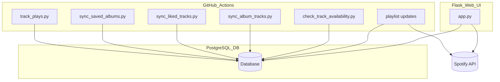

# 🍿 Spotify Library & Play History Tracker

This project tracks your Spotify library, play history, and builds smart playlists automatically using Python, PostgreSQL, GitHub Actions, and a Flask frontend deployed to Render.

---

## 📌 Features

* 🔄 Daily sync of Spotify saved albums and liked tracks
* 🎯 Hourly sync of recently played tracks
* 🧠 Smart playlist generation (never played, most played, recently added, etc.)
* ☁️ Hosted on [Render.com](https://render.com/) for API endpoints
* 🛠️ GitHub Actions for automation
* ⚠️ Handles Spotify rate limits automatically
* 🚀 Flask UI to run syncs, view logs, and generate refresh token

---

## 📁 Project Structure

```bash
spotify-oauth-tracker/
├── app/                      # Flask frontend (OAuth + script runner)
│   └── app.py
├── api_syncs/               # Spotify sync jobs (albums, tracks, plays)
│   ├── __init__.py
│   ├── check_track_availability.py
│   ├── sync_album_tracks.py
│   ├── sync_liked_tracks.py
│   ├── sync_saved_albums.py
│   └── track_plays.py
├── playlists/               # Playlist update logic
│   ├── update_playlist_most_played.py
│   ├── update_playlist_loved_added_last_30_days.py
│   ├── update_playlist_never_played.py
│   ├── update_playlist_never_played_new_tracks.py
│   ├── update_playlist_oldest_played.py
│   └── update_playlist_played_once.py
├── db/                      # Database initialization
│   └── init_db.py
├── reports/                 # (Planned) Usage reporting, analytics, graphs
├── utils/                   # (Planned) Shared helper functions/modules
├── .github/workflows/       # GitHub Actions
│   ├── check_track_availability.yml
│   ├── master_sync.yml
│   ├── sync_album_tracks.yml
│   ├── sync_albums.yml
│   ├── sync_liked_tracks.yml
│   ├── track_plays.yml
│   └── update_all_playlists.yml
├── render.yaml
├── requirements.txt
└── README.md
```

---

## 🗃️ PostgreSQL Schema

| Table                | Purpose                            |
| -------------------- | ---------------------------------- |
| `albums`             | Saved albums from library          |
| `tracks`             | All tracks (liked or from albums)  |
| `plays`              | Full history of Spotify plays      |
| `playlist_mappings`  | Maps playlist slugs to Spotify IDs |
| `track_availability` | Tracks removed from Spotify        |
| `logs`               | Output logs from syncs to debug    |

Tracks can be orphaned (not liked, not from albums) and are cleaned automatically.

---

## 🧠 Smart Playlists

| Script File                                   | Playlist Logic                             |
| --------------------------------------------- | ------------------------------------------ |
| `update_playlist_never_played.py`             | Tracks never played before                 |
| `update_playlist_played_once.py`              | Tracks played exactly once                 |
| `update_playlist_oldest_played.py`            | Tracks played more than once, oldest first |
| `update_playlist_most_played.py`              | Tracks with the most play count            |
| `update_playlist_loved_added_last_30_days.py` | Liked tracks added in the last 30 days     |
| `update_playlist_never_played_new_tracks.py`  | Newly added tracks never played            |

---

## 🔄 Automation via GitHub Actions

| Workflow File                  | Trigger/Schedule | Purpose                                     |
| ------------------------------ | ---------------- | ------------------------------------------- |
| `check_track_availability.yml` | Manual/Reusable  | Checks if synced tracks are still available |
| `master_sync.yml`              | Daily 7:07 UTC   | Syncs albums, tracks, liked tracks          |
| `sync_album_tracks.yml`        | Reusable         | Syncs album track details                   |
| `sync_albums.yml`              | Reusable         | Syncs saved albums                          |
| `sync_liked_tracks.yml`        | Reusable         | Syncs liked songs                           |
| `track_plays.yml`              | Every 10 minutes | Records recent play history                 |
| `update_all_playlists.yml`     | Daily 10:00 UTC  | Regenerates smart playlists                 |

---

## 🔐 Environment Variables

| Key                     | Purpose                      |
| ----------------------- | ---------------------------- |
| `SPOTIFY_CLIENT_ID`     | Spotify App Client ID        |
| `SPOTIFY_CLIENT_SECRET` | Spotify App Client Secret    |
| `SPOTIFY_REFRESH_TOKEN` | Token for refreshing auth    |
| `SPOTIFY_REDIRECT_URI`  | URI used during OAuth        |
| `DB_HOST`               | PostgreSQL host              |
| `DB_PORT`               | PostgreSQL port              |
| `DB_NAME`               | PostgreSQL DB name           |
| `DB_USER`               | PostgreSQL username          |
| `DB_PASSWORD`           | PostgreSQL password          |
| `FLASK_SECRET`          | Secret key for Flask session |

---

## ✅ Setup Guide

### 1. Clone the Repo

```bash
git clone https://github.com/confidentjohn/spotify-oauth-tracker.git
cd spotify-oauth-tracker
```

### 2. Register a Spotify Developer App

Create an app on the [Spotify Developer Dashboard](https://developer.spotify.com/dashboard/applications)
Set your redirect URI to `https://<your-app>.onrender.com/callback`

### 3. Deploy to Render

* Add as a **Web Service**, point to `app/app.py`
* Set all required environment variables (see above)
* Enable auto-deploy from GitHub

### 4. Get Your Refresh Token

* Visit `/login` on your deployed site
* Complete Spotify login
* Copy the refresh token from the `/callback` response

### 5. Initialize DB

Visit `/init-db` to create tables:

* `albums`, `tracks`, `plays`, `playlist_mappings`, `track_availability`

### 6. Add Playlist Mappings

```sql
INSERT INTO playlist_mappings (slug, name, playlist_id)
VALUES ('never_played', 'Never Played', 'your_spotify_playlist_id');
```

Repeat for each playlist.

### 7. Trigger a Sync Manually (via Web UI)

Visit any of the following:

* `/sync-saved-albums`
* `/sync-album-tracks`
* `/sync-liked-tracks`
* `/run-tracker`
* `/update-never-played-playlist` etc.

---

## 📊 Architecture Overview



---

## ⚙️ Rate Limit Handling

All Spotify API calls:

* Detect `429 Too Many Requests`
* Wait the appropriate `Retry-After` time
* Retry with exponential backoff if needed

Ensures syncs and playlist updates remain resilient.

---

## ✅ Example Logs

```text
🎼 Syncing album tracks for unsynced albums...
🎵 Fetching tracks for: Evermore (6AORtDjduMM3bupSWzbTSG)
⚠️ Rate limit hit. Retry #1 in 3s...
✅ Album tracks synced.
```

---

## 📂 Maintenance Notes

* `init_db.py` sets up schema and constraints
* `sync_album_tracks.py` only syncs albums missing tracks
* `track_plays.py` is run every 10 minutes and logs history
* Tracks that are neither liked nor in a saved album are cleaned
* Plays are **never deleted**, even if the track is removed from library

---

Feel free to fork, extend, and contribute!
