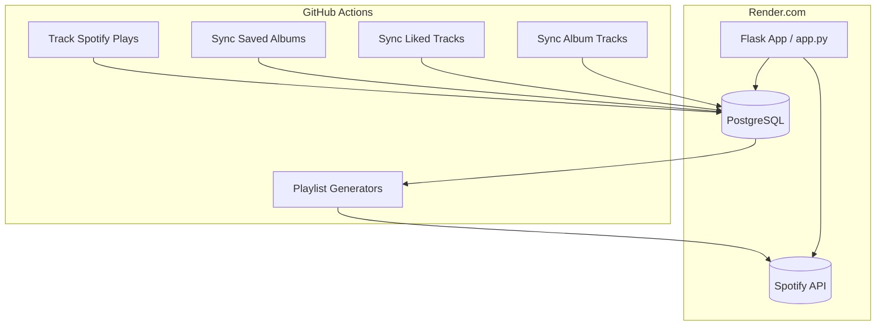

# 🎧 Spotify Library & Play History Tracker

This project tracks your Spotify library, play history, and builds smart playlists automatically using Python, PostgreSQL, and GitHub Actions.

---

## 📌 Features

- 🔄 Daily sync of Spotify saved albums and liked tracks
- 🎯 Hourly sync of recently played tracks
- 🧠 Smart playlist generation (never played, most played, recently added, etc.)
- ☁️ Hosted on [Render.com](https://render.com/) for API endpoints
- 🛠️ GitHub Actions for automation
- ⚠️ Handles Spotify rate limits automatically

---

## 📁 Project Structure

```bash
spotify-oauth-tracker/
├── app.py
├── init_db.py
├── sync_saved_albums.py
├── sync_album_tracks.py
├── sync_liked_tracks.py
├── track_plays.py
├── update_playlist_*.py
├── .github/workflows/
│   ├── sync_spotify_library.yml
│   ├── track_spotify_plays.yml
│   └── update_all_playlists.yml
└── requirements.txt
```

---

## 🗃️ PostgreSQL Schema

| Table               | Purpose                                |
|---------------------|----------------------------------------|
| `albums`            | Saved albums from library              |
| `tracks`            | All tracks (liked or from albums)      |
| `plays`             | Full history of Spotify plays          |
| `playlist_mappings` | Maps playlist slugs to Spotify IDs     |

Tracks can be orphaned (not liked, not from albums) and are cleaned automatically.

---

## 🧠 Smart Playlists

| Script File                             | Playlist Logic                                 |
|----------------------------------------|------------------------------------------------|
| `update_playlist_never_played.py`      | Tracks never played before                    |
| `update_playlist_played_once.py`       | Tracks played exactly once                   |
| `update_playlist_oldest_played.py`     | Tracks played more than once, oldest first   |
| `update_playlist_most_played.py`       | Tracks with the most play count              |
| `update_playlist_loved_added_last_30_days.py` | Liked tracks added in the last 30 days |

---

## 🔄 Automation via GitHub Actions

| Workflow                  | Schedule          | Action                                         |
|---------------------------|-------------------|------------------------------------------------|
| `track_spotify_plays.yml` | Hourly (7am–1am)  | Tracks Spotify plays and updates the DB       |
| `sync_spotify_library.yml`| Daily             | Syncs albums, tracks, liked tracks            |
| `update_all_playlists.yml`| After play sync   | Rebuilds all playlists                        |

---

## 🔐 Environment Variables

| Key                     | Purpose                            |
|------------------------|------------------------------------|
| `SPOTIFY_CLIENT_ID`     | Spotify App Client ID              |
| `SPOTIFY_CLIENT_SECRET` | Spotify App Client Secret          |
| `SPOTIFY_REFRESH_TOKEN` | Token for refreshing auth          |
| `SPOTIFY_REDIRECT_URI`  | URI used during OAuth              |
| `DB_HOST`               | PostgreSQL host                    |
| `DB_PORT`               | PostgreSQL port                    |
| `DB_NAME`               | PostgreSQL DB name                 |
| `DB_USER`               | PostgreSQL username                |
| `DB_PASSWORD`           | PostgreSQL password                |

---

## ✅ Setup Guide

### 1. Clone the Repo

```bash
git clone https://github.com/confidentjohn/spotify-oauth-tracker.git
cd spotify-oauth-tracker
```

### 2. Register a Spotify Developer App

Create an app on the [Spotify Developer Dashboard](https://developer.spotify.com/dashboard/applications)  
Set your redirect URI to `https://<your-app>.onrender.com/callback`

### 3. Deploy to Render

- Add as a Web Service, point to `app.py`
- Set all necessary environment variables
- Enable auto-deploy from GitHub

### 4. Get Your Refresh Token

- Visit `/login` on your deployed site
- Complete Spotify login
- Copy the refresh token from the `/callback` response

### 5. Initialize DB

Visit `/init-db` to create tables:
- `albums`, `tracks`, `plays`, `playlist_mappings`

### 6. Add Playlist Mappings

```sql
INSERT INTO playlist_mappings (slug, name, playlist_id)
VALUES ('never_played', 'Never Played', 'your_spotify_playlist_id');
```

Repeat for each playlist.

### 7. Trigger a Sync

Visit:

- `/sync-library`
- `/track-plays`
- `/update-never-played-playlist` etc.

---

## 📊 Architecture Overview



---

## ⚙️ Rate Limit Handling

The Spotify API enforces rate limits (429 errors). All API interactions are wrapped with retry logic that:

- Detects `429 Too Many Requests`
- Waits `Retry-After` seconds
- Logs retry attempts

This ensures your syncs won’t fail silently.

---

## ✅ Example Logs

```text
🎼 Syncing album tracks for unsynced albums...
🎵 Fetching tracks for: Evermore (6AORtDjduMM3bupSWzbTSG)
⚠️ Rate limit hit. Retry #1 in 3s...
✅ Album tracks synced.
```

---

## 📂 Maintenance Notes

- `init_db.py` sets up schema and constraints
- `sync_album_tracks.py` only syncs unsynced albums
- Tracks not liked and not from albums are cleaned up
- `plays` are **not deleted**, even if the track is removed from library

---

Feel free to fork and extend. PRs welcome!