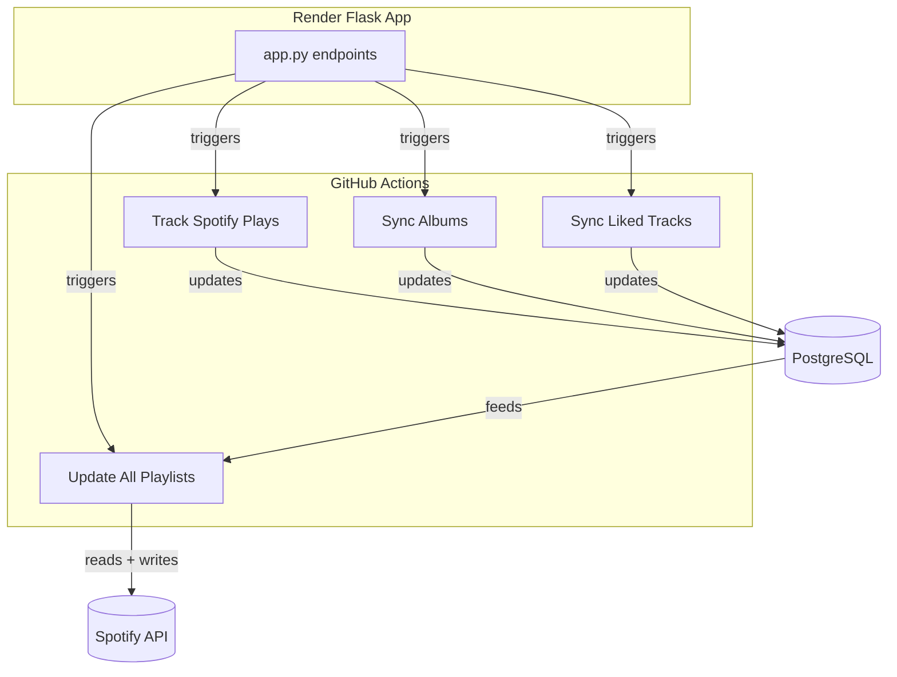

# 🎧 Spotify Library & Play History Tracker

This project tracks your Spotify library, play history, and builds smart playlists automatically using Python, PostgreSQL, and GitHub Actions.

---

## 📌 Features

* 🔄 Daily sync of Spotify saved albums and liked tracks
* 🎯 Hourly sync of recently played tracks
* 🧠 Smart playlist generation (never played, most played, recently added, etc.)
* ☁️ Hosted on [Render.com](https://render.com/) for API endpoints
* 🛠️ GitHub Actions for automation

---

## 📁 Project Structure

```bash
spotify-oauth-tracker/
├── app.py                       # Flask web interface for triggering syncs
├── init_db.py                  # Creates DB tables (albums, tracks, plays, playlist_mappings)
├── sync_albums.py              # Syncs saved albums & album tracks
├── sync_liked_tracks.py        # Syncs liked/saved tracks
├── track_plays.py              # Syncs recently played tracks
├── update_playlist_*.py        # Scripts to create/update smart playlists
├── .github/workflows/
│   ├── sync_spotify_library.yml
│   ├── track_spotify_plays.yml
│   └── update_all_playlists.yml
└── requirements.txt            # Dependencies
```

---

## 🗃️ PostgreSQL Schema Overview

* `albums` — All saved albums
* `tracks` — All tracks, with flags for `is_liked` and `from_album`
* `plays` — Timestamped history of played tracks
* `playlist_mappings` — Maps internal playlist scripts to real Spotify playlist IDs

---

## 🧠 Playlists Generated

| Script File                                   | Playlist Logic                             |
| --------------------------------------------- | ------------------------------------------ |
| `update_playlist_never_played.py`             | Tracks never played before                 |
| `update_playlist_played_once.py`              | Tracks played exactly once                 |
| `update_playlist_oldest_played.py`            | Tracks played more than once, oldest first |
| `update_playlist_most_played.py`              | Tracks with the most play count            |
| `update_playlist_loved_added_last_30_days.py` | Liked tracks added in the last 30 days     |

---

## 🔄 Automation via GitHub Actions

* **`Track Spotify Plays`**

  * ⏱️ Runs hourly
  * Updates the `plays` table
* **`Sync Spotify Albums`**

  * ⏰ Runs daily
  * Refreshes `albums` and `tracks` tables
* **`Sync Liked Tracks`**

  * ⏰ Runs daily
  * Refreshes `is_liked` flags
* **`Update All Playlists`**

  * 🚀 Triggers after `Track Spotify Plays`
  * Updates all smart playlists

---

## 🔐 Environment Variables (Render.com + GitHub Secrets)

| Key                     | Purpose                   |
| ----------------------- | ------------------------- |
| `SPOTIFY_CLIENT_ID`     | Spotify App Client ID     |
| `SPOTIFY_CLIENT_SECRET` | Spotify App Client Secret |
| `SPOTIFY_REFRESH_TOKEN` | Token for refreshing auth |
| `SPOTIFY_REDIRECT_URI`  | URI used during OAuth     |
| `DB_HOST`               | PostgreSQL host           |
| `DB_PORT`               | PostgreSQL port           |
| `DB_NAME`               | PostgreSQL DB name        |
| `DB_USER`               | PostgreSQL username       |
| `DB_PASSWORD`           | PostgreSQL password       |

---

## 🌐 Triggering Syncs Manually

Hosted on Render (example URLs):

* `https://<your-app>.onrender.com/sync-albums`
* `https://<your-app>.onrender.com/sync-liked-tracks`
* `https://<your-app>.onrender.com/run-tracker`
* `https://<your-app>.onrender.com/update-never-played-playlist`

---

## 📊 Architecture Diagram



---

## ✅ Setup Guide (Step-by-Step)

Follow these steps to get the tracker running smoothly with your Spotify account:

---

### 1. Clone the Repo

```bash
git clone https://github.com/confidentjohn/spotify-oauth-tracker.git
cd spotify-oauth-tracker
```

---

### 2. Register a Spotify Developer App

Go to the [Spotify Developer Dashboard](https://developer.spotify.com/dashboard/applications) and:

* Click **Create App**
* Set the **Redirect URI** to `https://<your-render-app>.onrender.com/callback`
* Note the `Client ID` and `Client Secret`

---

### 3. Configure Environment Variables

Set these secrets in **Render.com** and **GitHub Secrets**:

| Variable                | Description                                     |
| ----------------------- | ----------------------------------------------- |
| `SPOTIFY_CLIENT_ID`     | From your Spotify app                           |
| `SPOTIFY_CLIENT_SECRET` | From your Spotify app                           |
| `SPOTIFY_REDIRECT_URI`  | e.g. `https://<your-app>.onrender.com/callback` |
| `DB_HOST`               | Your PostgreSQL host (Render or other)          |
| `DB_PORT`               | Usually `5432`                                  |
| `DB_NAME`               | Your DB name                                    |
| `DB_USER`               | Your DB username                                |
| `DB_PASSWORD`           | Your DB password                                |

In GitHub: go to your repo → **Settings** → **Secrets and variables** → **Actions**

---

### 4. Deploy to Render

* Add a new **Web Service**
* Point to `app.py`
* Set your **environment variables**
* Deploy the app

Test the web app by visiting:
`https://<your-app>.onrender.com`

---

### 5. Initialize the Database

Once the app is live:

* Open: `https://<your-app>.onrender.com/init-db`
* This will create all necessary tables (`albums`, `tracks`, `plays`, `playlist_mappings`)

---

### 6. Get Your Spotify Refresh Token

* Visit `https://<your-app>.onrender.com/login`
* Authenticate with your Spotify account
* You’ll be redirected with a **refresh token** shown in the browser
* Copy this and add it as `SPOTIFY_REFRESH_TOKEN` in your GitHub and Render secrets

---

### 7. Add Your Smart Playlist Mappings

Each playlist-generating script looks up its destination from the DB.

Use this SQL to add a mapping:

```sql
INSERT INTO playlist_mappings (slug, name, playlist_id)
VALUES (
  'never_played',
  'Never Played',
  'your_spotify_playlist_id_here'
);
```

Repeat for:

* `played_once`
* `oldest_played`
* `most_played`
* `loved_added_last_30_days`

Find the Playlist ID in the Spotify URL like:
`https://open.spotify.com/playlist/**YOUR_ID**?si=...`

---

### 8. Trigger a Manual Sync

From your browser:

* `/sync-albums`
* `/sync-liked-tracks`
* `/run-tracker`
* `/update-never-played-playlist` (and others)

---

### 9. Enable GitHub Actions

GitHub Actions automate everything:

* Runs hourly/daily
* Keeps the DB up to date
* Updates playlists continuously

Check `.github/workflows/` — it’s already preconfigured!

---

🎉 You're done!

Your Spotify data is now automatically tracked and transformed into dynamic playlists.

---

For questions or enhancements, feel free to open an issue or fork the project 🚀
